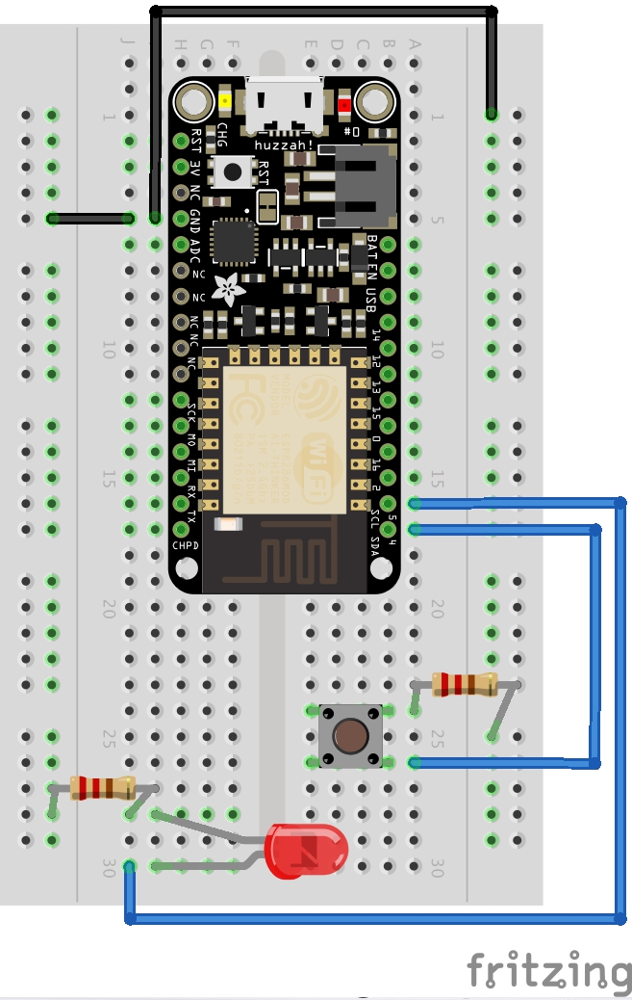

# Using a Button

TL;DR - [jump to the final code](#final-code)  
**or**  
If you only want to see how a button works in isolation - [jump to the short code](#short-code)

In this chapter we'll add a push button to our board. This is one of the simplest ways to build on what we've already done and add some human interaction to our project. If you haven't already, jump back to [Using an LED](/using-an-led) to get your board to the right place. Now we'll add a push button that turns the LED lights on and off. As before, we'll split the chapter into two parts: [wires](#the-wires) and [code](#the-code).

<h2 id="the-wires">The Wires</h2>  

### Materials
1. [1 x Feather Huzzah](https://www.adafruit.com/products/2821). This is the board I'll be using. Feel free to use any ESP8266 model you have, but know some of the pinouts might be arranged differently.  
2. [1 x Half breadboard](https://www.adafruit.com/products/64). For plugging stuff into.  
3. [1 x LED Bulb](https://www.adafruit.com/products/777). I'll be using a red 88888V for no reason.  
4. 4 x wires. Different colors help, but it's not important that they match my diagram.  
5. [2 x 1K resistor](https://www.adafruit.com/products/2892). This will stop things from blowing up.  
6. 1 x micro-usb cable for transmitting code and powering the device.  
7. **1 x mechanical push button**.  

All of these materials are from [Using an LED](/using-an-led), *except* for **(7)**: 1 x mechanical push button, and a couple extra wires and resistors.



### Ground
As before, we'll use the boards Ground `(-)` column to control the current. The push button is an open circuit when it's not being pushed, and a closed circuit when you push it. Pushing down on the rubber connects a metal plate that completes the circuit and allows electricity to flow. Are you seeing a pattern? As with the LED, we measure and redirect circuits to control the state of our application.

Since the button is on the opposite side of the bread board, I ran another wire across to the `gnd` pin for convenience, and to prevent to much wire crossing. Now I can easily ground on both sides of my breadboard.

### Button
Add anywhere you like on the board, but be sure to leave enough space to actually push it without bonking your wires and bulbs!

### Resistor
Add another 1k resistor from the button to ground `(-)` to stabilize the current when the circuit is closed.

### Power
Run a wire from the pin not currently in use on the button to `D5` on your Feather. On this circuit, the button will accept a current from `D5`. When the button is pressed, the circuit is closed and the current continues on through the resistor and into ground. We will watch this circuit from our code to control the LED.

<h2 id="the-code">The Code</h2>
### New ThingsSDK Project
Let's continue from where we left off in [Using an LED](/using-an-led). If you haven't already, I suggest you go back and start with that. If you'd prefer, you can just [grab the final code](/using-an-led/#final-code) and start a new project anytime using:
```bash
$ thingssdk new Button_Example
```

When you're confident it works, delete everything in ./main.js so we can start clean.

### Using setWatch()
We need to listen for changes to the state of `D5`, where our button is connected. Espruino gives us a convenient listener for exactly that:

`setWatch(callback, pinNumber, options)`

For now, let's have `setWatch()` `console.log()` the event whenever the button is pressed.

```javascript
setWatch(event => console.log(`button pushed: ${ JSON.stringify(event) }`), D5);
```

Run `npm run push` and when the code is loaded, try pushing your button! You should see something like this in your console:

```bash
Connecting REPL...
espruino:  Espruino Command-line Tool 0.0.21
-----------------------------------

espruino:  Connecting to '/dev/cu.SLAB_USBtoUART'
espruino:  Connected
button pushed: {"time":295.81545899999,"pin":D5,"state":false}
```

But notice it only works one time. No matter how you push the button, we never see another log message. What gives?

### Using pinMode()
Let's try using some of the optional parameters for `setWatch()` From the Espruino documentation on [`setWatch()`](http://www.espruino.com/Reference#l__global_setWatch), we find this:

>**Parameters**  
>...  
>**options** If this is a boolean or integer, it determines whether to call this once (false = default) or every time a change occurs (true)
>If this is an object, it can contain the following information: { repeat: true/false(default), edge:'rising'/'falling'/'both'(default), debounce:10}. debounce is the time in ms to wait for bounces to subside, or 0.

```javascript
setWatch(event => console.log(`button pushed: ${ JSON.stringify(event) }`), D5, { repeat: true });
```

This repeat option looks promising! But we see the same results in the console as before. Something weird is going on here with the Espruino internals. Let's add a `console.log()` statement to see what's going on.

```javascript
console.log(`D5 pin mode = ${ getPinMode(D5) }`)

setWatch(event => console.log(`button pushed: ${ JSON.stringify(event) }`), D5, { repeat: true });
```

```bash
Espruino is Open Source. Our work is supported
only by sales of official boards and donations:
http://espruino.com/Donate
espruino:  Flash map 4MB:512/512, manuf 0xef chip 0x4016
espruino:  
espruino:  >echo(0);
espruino:  D5 pin mode = input_pullup # <--- hmmmmm
```

The console reports that `D5`'s pin mode is unsurprising. `input_pullup` is the default mode for `D5` on an ESP8266. You can read more about the difference between input and input_pulldown [on this helpful stackoverflow](http://electronics.stackexchange.com/questions/67007/whats-the-difference-between-input-and-input-pullup).

Well something fishy must be happening. If we read the whole Espruino documentation, [we'd eventually find this](http://www.espruino.com/Reference#l__global_digitalWrite):

> **function digitalWrite =>**  
> ...  
> **Note**: if you didn't call pinMode beforehand then this function will also reset pin's state to "output"
Let's try manually setting the pin mode ourselves.

So it looks like Espruino might sometimes try to optimize our pinModes for us when we're not looking, unless we specifically tell it how we want our pins to behave up front. Let's try that now:

```javascript
pinMode(D5, 'input_pullup')

setWatch(event => console.log(`button pushed: ${ JSON.stringify(event) }`), D5, { repeat: true });
```

Tada! Now we see our `console.log()` message every time the state of `D5`, both when the button goes up *and* down.

### Connecting the LED
So we have this LED all plugged in and waiting for something to interact with. Let's start by specifying a pinMode for `D1`. We should move our callback out into a separate function too now that it's going to grow. Let's also turn on the light to be sure it's working on `D4`.

```javascript
pinMode(D4, 'output');
pinMode(D5, 'input_pullup');

const flipLight = event => {
  console.log(`button pushed: ${ JSON.stringify(event) }`);
}

setWatch(flipLight, D5, { repeat: true });

digitalWrite(D4, !isOn)
```

```bash
$ npm run push
```

Your LED should be on! Now let's flip the state of the LED every time the button is pushed. We'll read the current state of the pin and set the new state to be the opposite on every change event of `D5`.

```javascript
pinMode(D4, 'output');
pinMode(D5, 'input_pullup');

const flipLight = event => {
  console.log(`button pushed: ${ JSON.stringify(event) }`);
  const isOn = digitalRead(D4)
  digitalWrite(D4, !isOn)
}

setWatch(flipLight, D5, { repeat: true });
```

```bash
$ npm run push
```

Cool! The light comes on and off in response to our button presses!

### Persisting the Light
What we really want is for the light to stay on after we've released the button, and turn off again when we press the button again. The problem is that by default our `setWatch()` listener captures *all* change events. This includes the voltage coming up ("rising") and dropping off ("falling"). Remember how the button works: button down connects, button up disconnects. That means that pushing *and* releasing trigger state changes to `D5`. But we can specify that we only want to track events of either kind. Let's track only the times we push the button:

```javascript
pinMode(D4, 'output');
pinMode(D5, 'input_pullup');

const flipLight = event => {
  console.log(`button pushed: ${ JSON.stringify(event) }`);
  const isOn = digitalRead(D4)
  digitalWrite(D4, !isOn)
}

setWatch(flipLight, D5, { repeat: true, edge: 'falling' });
```

```bash
$ npm run push
```

Now the button press should *mostly* turn the LED on and off.

### Debouncing
You might find that sometimes the light flashes back off or on even when you've only pressed the button once. Actually you might subtly have pressed or jostled the button to alter the circuit (and thus the state of `D5`) more than once very quickly. Electronics are sensitive!

We can help smooth these little noise signals out by *debouncing* the signal stream. Adding a `debounce` field to options allows us to say that we only care about events that occur *after* a given number of milliseconds.

```javascript
pinMode(D4, 'output');
pinMode(D5, 'input_pullup');

const flipLight = event => {
  console.log(`button pushed: ${ JSON.stringify(event) }`);
  const isOn = digitalRead(D4)
  digitalWrite(D4, !isOn)
}

setWatch(flipLight, D5, { repeat: true, edge: 'falling', debounce: 50 });
```

```bash
$ npm run push
```

The LED transitions should be much more stable now that we're ignoring signals 50ms after each button press. And that's how to connect a button to an LED!

## Further Exercises
1. Make the button flip the onboard blue light and red light at the same time.  
2. Make the button flip the onboard light and red light in contrast (one's on while the other's off).  
3. Add a second button that controls the blue light independently from the red light.  
4. Have separate on/off buttons for the red light. One button only turns on the red light, and the other button only turns off the red light.


<h2 id="final-code">Final Code</h2>
```javascript
// main.js

pinMode(D4, 'output');
pinMode(D5, 'input_pullup');

const flipLight = event => {
  console.log(`button pushed: ${ JSON.stringify(event) }`);
  const isOn = digitalRead(D4)
  digitalWrite(D4, !isOn)
}

setWatch(flipLight, D5, { repeat: true, edge: 'falling', debounce: 50 });

```

<h2 id="short-code">Short Code</h2>
```javascript
// main.js

pinMode(D5, 'input_pullup'); // Set the pinMode explicitly
// setWatch(callback, pin, options /* true = keep listening beyond the first event */)
setWatch(event => console.log(`button pushed: ${ JSON.stringify(event) }`), D5, true);

// See: http://www.espruino.com/Reference#l__global_setWatch
```
