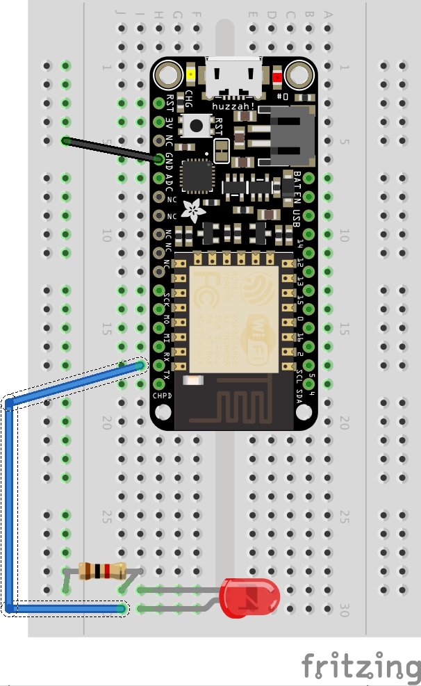

# Using an LED

TL;DR : [the final code](#final-code)

In this chapter we'll cover the basics of using an LED light! You've already used the onboard LED of your device in [Hello World](https://guides.thingssdk.com/examples/hello_world.html), and the basic principles are the same. Indeed! The basic principles of most Things development are represented here: properly route power from the device to the peripherals, then write code that cuts or sends the power as you like. Wiring LED's demonstrates most of the basic workflow of any things project. We'll break this into two parts: [the wires](#the-wires) and [the code](#the-code).

<h2 id="the-wires">The Wires</h2>
### Materials
1. [1 Feather Huzzah](https://www.adafruit.com/products/2821). This is the board I'll be using. Feel free to use any ESP8266 model you have, but know some of the pinouts might be arranged differently.
2. [1 Half breadboard](https://www.adafruit.com/products/64). For plugging stuff into.  
3. [1 LED Bulb](https://www.adafruit.com/products/777). I'll be using a red 88888V for no reason.  
4. 2 wires. Different colors help, but it's not important that they match my diagram.  
5. [1 1K resistor](https://www.adafruit.com/products/2892). This will stop things from blowing up.
6. A micro-usb cable for transmitting code and powering the device.



**DISCLAIMER: BE SURE TO UNPLUG AND POWER DOWN YOUR DEVICE BEFORE DOING ANY WIRING** This protects you and your equipment.

### Ground
It's a good idea to start a project by grounding your board. Look for a pin labeled "GND" on your devices.

### LED
I like to leave as much space as possible on my board. The long leg of your LED is the positive side.

### Resistor
Using the right kind and number of resistors is important to having a stable circuit. [You can get a quick reference for reading resistor bands here](http://www.ladyada.net/images/metertutorial/rescolorcode.jpg). It might be frustrating at first. The color code was developed under very different assumptions than we operate today. You'll get better at reading them the more you do it! For now, just match your resistor to the one in my picture. It should have a brown, black, red, and gold band.

Run the resistor from the boards ground `(-)` to the negative (short) leg of the LED. It doesn't matter which direction you face the bands. Resistors are not directional.

### Power
Finally, run a wire from the positive leg of your LED to pin D1. You can see it on the chart above, or use this one for reference. [](http://www.espruino.com/EspruinoESP8266) 

Another good resource on the specific nature of each pin lives [over here at adafruit](https://learn.adafruit.com/adafruit-feather-huzzah-esp8266/pinouts/#gpio-pins). 

We're all wired up! Now we can write some code!

<h2 id="the-code">The Code</h2>
### New ThingsSDK Project
The first step is start a new Things project. Plug your device into your desired USB port. Then in your terminal run:
```bash
$ thingssdk new LED_Example
```

You should see this in your console:
```bash
thingssdk new LED_Example
? Select a port: (Use arrow keys)
? Select a port: # This will show your port
? Select the baud rate: (Use arrow keys)
? Select the baud rate: 115200
To install the project dependencies:
    cd LED_Example && npm install
To upload to your device:
    cd LED_Example && npm run push
Project successfully created
```

Follow the prompts to get our dependencies installed:

```bash
$ cd LED_Example && npm install
```

When everything is installed, `$ npm run push` sends the code to your device and run it. I like to perform a quick sanity check with the default hello world code just to make sure everything is correctly connected.

```bash
$ npm run push
```

### Light the LED
Technically you've already lit an LED! It might even be blinking right now, using the hello world default code! In `./main.js`, `digitalWrite()` changes the state of pin `D2`, which on the ESP8266 is its onboard LED.

We want to power our peripheral LED bulb instead. So we need to change the state of the pin we're expecting it to draw power from: `D1`.

```javascript
// ./main.js
let isOn = false;
const interval = 500;

setInterval(() => {
    isOn = !isOn;
    digitalWrite(D1, isOn); // Changed D2 to D1
}, interval);
```

You're done! [`digitalWrite()`](http://www.espruino.com/Reference#l__global_digitalWrite) will search the board for pins according the number you feed it.

This is the fundamental workflow of all Things projects, no matter how large or complex. Plug stuff in to pins on the board. Switch power to the pins on and off depending on certain conditions. The rest of this book will show how to get different components to interact in interesting ways.

### Troubleshooting
If you're light isn't blinking, you might be in for a treat! In Things development there are additional points of failure compared with web development. On top of all our code, there're all the wires and mechanical devices. Just like web development, it's important to test only one hypothesis at a time while debugging. Don't switch the LED *and* the pin at the same time before trying again. This will help you systematically rule out possible problems, and empower you to get help from others if needed.

Here're some suggestions for where to begin.

#### Hardware
1. Unplug the device, wait a second, and plug it back in. Try again. Seriously, this is your life now.  
2. Ensure all the wires are properly connected and that they have a good  attachment to the breadboard. Jiggle them around a little to make sure. This is your life now.  
3. Try swapping some of the parts out for identical parts. Start with the easiest ones and keep on going until you've tried them all. Sometimes the a bulb can be dead on arrival, or wires can fray internally or be broken. Sometimes a breadboard may get old and have trouble carrying a charge. THIS IS YOUR LIFE NOW!  
4. Try a different pin. This is kind of a hybird between hardware and software, since you'll need to update your code to reflect the change. For example, if you switch the wire connecting the Feather to the LED from D1 to D3, you'll need to change `digitalWrite(D1, isOn);` to `digitalWrite(D3, isOn);`

#### Software
1. Check the contents of the './build' directory to see what ThingsSDK is compiling. Does anything look super weird in there? Is any of the code you wrote missing? This might guide you toward the problem in your source code in `./main.js`. **If you do find a problem and you can reproduce it, [file an issue on Github]()** 🙇🏻  
2. Try adding some `console.log()` statements. Do some of them produce output and not others? Do they print at surprising points of the push cycle?  
3. Depending what board you're using, and what pins you're manipulating, you might need to manually set their mode using [`pinMode()`](http://www.espruino.com/Reference#l__global_pinMode).

### Further Exercises
1. Try using a different port. Try every port on the board and see if you get different results!  
2. Try adding a second LED. Make sure to add a resistor, too.  
3. Try making a mini light show using several different colored lights that blink at different intervals.  
4. Try setting the intervals to your favorite song!

<h2 id="final-code">Final Code</h2>
```javascript
let isOn = false;
const interval = 500;

setInterval(() => {
    isOn = !isOn;
    digitalWrite(D1, isOn); // Changed D2 to D1
}, interval);
```
